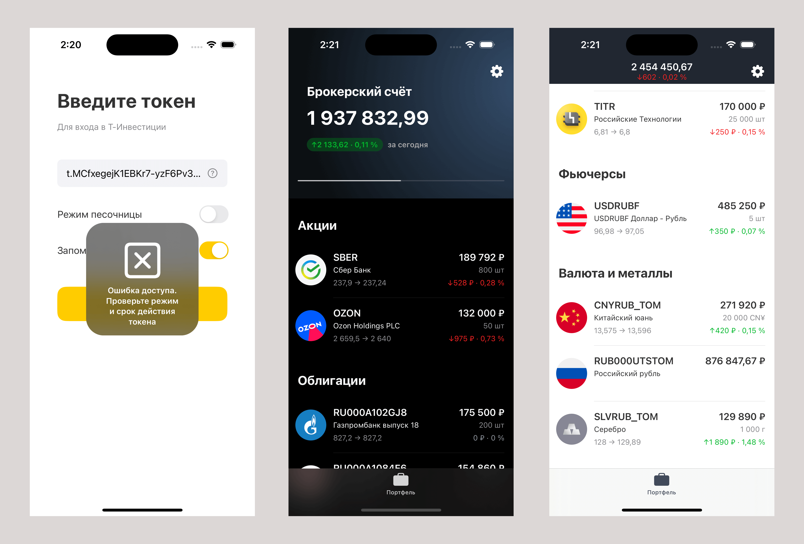

# T-Stocks
Альтернативное iOS приложение Т-Инвестиции.

- DI: constructor injection
- навигация: self-deallocated coordinator
- презентационный слой: MVP, вёрстка кодом на UIKit с использованием SnapKit
- слой доступа к данным: репозитории и сервисы
- сетевой слой: менеджер, использующий HTTP клиент на URLSession с ручным управлением кэширования
- бэкенд: [T‑Bank Invest API](https://www.tbank.ru/invest/open-api/)
- хранение токена в Keychain с доступом по Face ID
- русская и английская локализации

Для тестирования можно использовать мой токен для песочницы:

  
Тестовый токен

  
  `t.MCfxegejK1EBKr7-yzF6Pv3DEylk01rTM9jnHC0bZ9pRAvFZi4SIheGShCVK-1qeLieWDOkzAx58f4sBFcoTbA`
  

